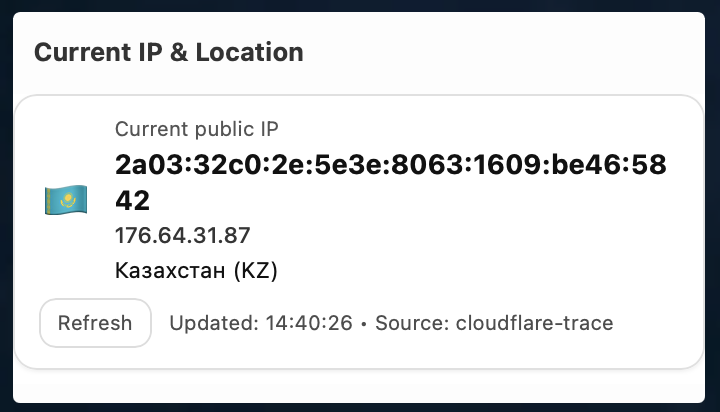

# Location Widget

Mini widget for the start.me start page: shows public IP, IPv4 (if available), country, and flag. Refreshes every 60 seconds and supports manual refresh.

## Features

- IPv6 and country code via Cloudflare trace.
- Separate IPv4 request via ipify.
- Localized country name (if `Intl.DisplayNames` is supported).
- Refresh button and auto-refresh once per minute.
- Single HTML file with no build or dependencies.

## Usage

1. Open `ip-location.html` in a browser to check.
2. For start.me: host `ip-location.html` on any HTTPS hosting and add a Custom iframe/URL widget with the file link.
3. Edit styles in the `<style>` block if needed.

## Data Sources

- `https://cloudflare.com/cdn-cgi/trace` and `https://1.1.1.1/cdn-cgi/trace` - IPv6 and country code.
- `https://api4.ipify.org` (fallback `https://api.ipify.org`) - IPv4.

## Structure

- `ip-location.html` - the widget itself.
- `location-widget.png` - screenshot.
- `LICENSE` - Unlicense (public domain).

## Donates

